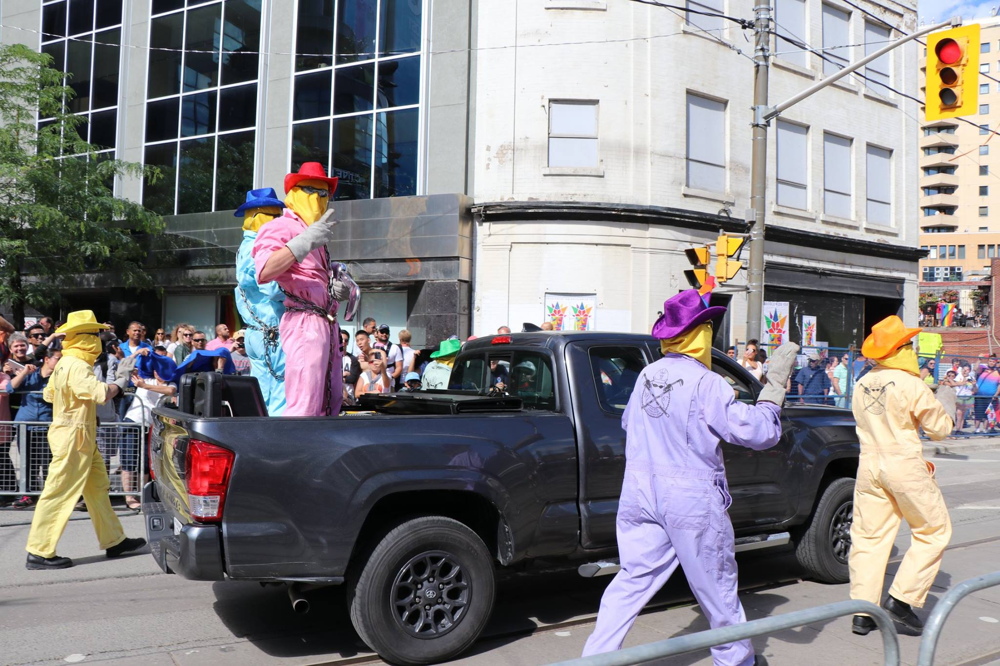

# Main Title

A picture.



*Caption: This is a caption*

## Sub-Title

This is an example of a table:

First Header | Second Header | Third Header
------------ | ------------- | ------------
Content Cell | Content Cell  | Content Cell
Content Cell | Content Cell  | Content Cell

Another example of a table:

| First Header | Second Header | Third Header |
| ------------ | ------------- | ------------ |
| Content Cell | Content Cell  | Content Cell |
| Content Cell | Content Cell  | Content Cell |

Specifying table alignment:

First Header | Second Header | Third Header
:----------- |:-------------:| -----------:
Left         | Center        | Right
Left         | Center        | Right

**Bolded Paragraph Start** This is an example of a regular paragraph element, here is a link: [in](http://domospetitus.org/pronumque-solacia). You can say anything in this block of text

    Inserting a tab creates a code block theme:

    var scareware_dma = pop_external_joystick(query_grep(vfat, clipboardEditor,
            50), 57);
    zip = python_meme_lion / mnemonic / net * fifo + telecommunications;
    camelcase_media(interlaced);

Another method to create code blocks where you can specify the language:

PYTHON:

```python
def fn():
    pass
    if (this thing):
        do_something_with_python()
    else:
        dont
```

C:

```C
int main(){
    printf("Hello World");
    printf(69);
    cout << "Hello World";
}
```